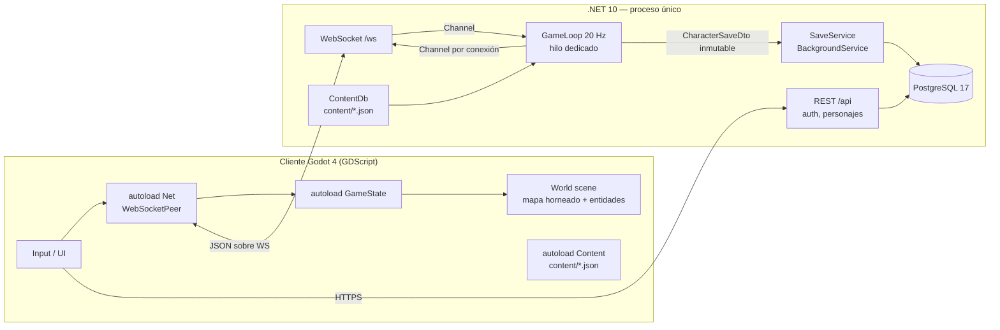
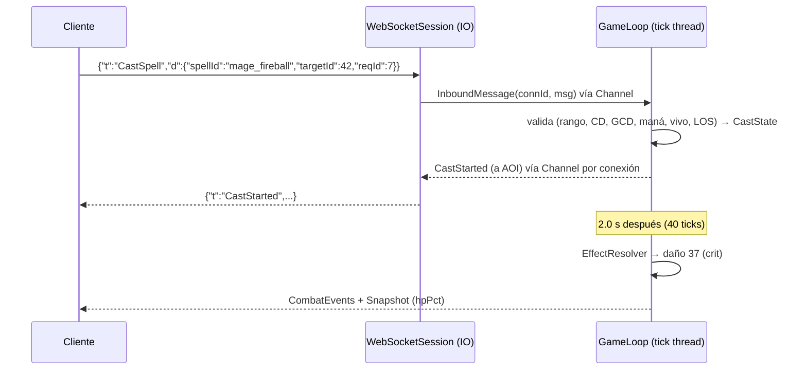

# Arquitectura técnica

## 1. Vista general



## 2. Proyectos .NET y dependencias

```
Protocol  ←  Game  ←  Server  →  Persistence
   ↑          ↑                      ↑
   └──── Content ─────────────────────┘ (Content solo depende de Protocol para enums compartidos)
```
- `PixelRealms.Protocol`: `record` DTOs, `MessageRegistry` (nombre `t` ⇄ tipo C#), `ProtocolVersion` const, `JsonSerializerContext`
  (System.Text.Json **source generated**, `camelCase`). Cero dependencias.
- `PixelRealms.Content`: modelos inmutables (`ClassDef`, `SpellDef`, `EffectDef`, `ItemTemplate`,
  `MonsterTemplate`, `LootTable`, `RulesDb`), `ContentDb` con diccionarios `FrozenDictionary<string, T>`, validación.
  `RulesDb` (de `content/rules.json`) se inyecta como `IRules` en todos los sistemas, también la IA de monstruos
  (`rules.ai`: percepción, A*, patrulla) y lo social (`rules.social`: chat e intercambio). Recarga en caliente (ADR-008):
  `/reload rules` llama a `ReloadableContent.ReloadRules()`; `TickContext.Rules` se relee al empezar cada tick, así que el
  cambio entra en el tick siguiente sin reiniciar, y las stats derivadas cacheadas se recalculan en ese momento. Si el JSON
  no valida (incluidos los pares mínimo/máximo que el tick usa como rango), se conserva el anterior y el admin ve el error.
- `PixelRealms.Game`: `World` = colección de `MapInstance` (estado vivo: jugadores, monstruos, loot, amenaza, AOI) sobre
  `MapData` inmutables compartidos (ADR-007); `Player`, `Monster`, `Actor`; sistemas por instancia (`MovementSystem`, `CastSystem`,
  `AuraSystem`, `MonsterAiSystem`, `ResourceSystem`, `LootSystem`, `SpawnSystem`, `InterestSystem`), servicios globales
  (`CombatCalculator`, `StatCalculator`, `Inventory`, `TradeService`, `PartyService`, `ChatService`, `PvpService`); la afinidad
  la da `rules.Affinity.MultiplierFor(clase, tipo)`.
  Emite `IGameEvent`s en una lista por tick.
- `PixelRealms.Persistence`: `GameDbContext`, entidades EF, `ICharacterRepository`, `IAccountRepository`.
- `PixelRealms.Server`: `Program.cs` (minimal APIs), `ConnectionManager`, `WebSocketSession`,
  `GameLoopService : IHostedService` (arranca el hilo), `MessageRouter`, `SnapshotBuilder`, `SaveService`,
  `WorldStats` (recuentos, tiempos de combate y memoria asignada por segundo por instancia, que calcula el hilo del tick y
  publica como copia inmutable para `/admin/stats`; la memoria sale de `Simulation.InstanceAllocs`).

## 3. Game loop (servidor)

Tick fijo `Δt = 50 ms` (20 Hz) en un **hilo dedicado** (`new Thread(..., IsBackground=true)`), con
acumulador y `Stopwatch` para no derivar. Si un tick tarda > 50 ms se registra `warn` con duración.

Orden estricto de cada tick (los pasos 3–9 se ejecutan **por cada `MapInstance`**; el cambio de mapa de un jugador se aplica en el paso 2):
1. `DrainInbound()` – vacía `Channel<InboundMessage>` (máx 500 msgs/tick). Conexiones/desconexiones incluidas.
2. `Commands` – valida y aplica intenciones (`MessageRouter` → handlers). Handlers **no** calculan daño:
   encolan acciones (`BeginCast`, `SetMoveInput`, `InventoryOp`).
3. `MovementSystem` – integra movimiento con colisión AABB contra la grilla de colisión de la instancia (`MapInstance.Collision`:
   la del mapa o, si tiene puertas, una copia propia donde las cerradas son sólidas). Después, `MapObjectSystem` cierra las
   puertas cuyo plazo venció (palancas y puertas, HU-083).
4. `CastSystem` – avanza casteos, resuelve los completados → `EffectResolver` (daño, cura, auras).
5. `AuraSystem` – ticks de DoT/HoT, expiraciones.
6. `MonsterAiSystem` – monstruos: Idle → Chase → Attack → Evade (`AiState`).
7. `ResourceSystem` – maná/energía/ira, vida fuera de combate.
8. `DeathSystem` / `LootSystem` / `SpawnSystem` (reaparición de monstruos).
9. `InterestSystem` – recalcula AOI (celdas de 16×16 tiles) → spawns/despawns por observador.
10. `Outbound` – cada 2 ticks `SnapshotBuilder` construye un snapshot por jugador; eventos del tick
    (`CombatEvents` agrupados por tick, `AuraApplied`…) se envían a quienes tengan la entidad en su AOI.
11. `Persistence` – jugadores `Dirty` con autosave vencido (60 s, appsettings `Persistence:AutosaveSec`) → `CharacterSaveDto` a `SaveService`.



## 4. Red

- Transporte: **WebSocket** (`/ws`) — funciona en escritorio, móvil y **web export** de Godot.
- Formato: JSON texto, sobre `{ "t": string, "d": object }`. Límite 4 KB por mensaje entrante.
- Autenticación: login REST → JWT (15 min) → `POST /api/game/ticket` (ticket de un solo uso, 30 s) →
  `ws://host/ws?ticket=...` (el navegador no permite headers en WebSocket). Primer mensaje: `Hello`.
- Rate limiting por conexión (token bucket, appsettings `Net:RateLimits`, no `rules.json`): `MoveInput` 30/s con ráfaga de 90 (un corte de red breve entrega los inputs de golpe), `CastSpell` 10/s, `Chat` 5/5 s, resto 20/s.
  El mensaje que excede se descarta con `Error{code:"rate_limited"}`; exceder 3 veces en 10 s → desconexión.
- Heartbeat: `Ping` cada 5 s; sin tráfico 15 s → desconectar. Reconexión: el personaje queda 10 s en el mundo
  ("linkdead") para evitar abuso de desconectar en combate.

### Movimiento (predicción + reconciliación)
- Cliente simula a ticks fijos de 50 ms (acumulador propio, no los frames) y envía un `MoveInput { seq, dx, dy }`
  (8 direcciones, valores −1/0/1) por cada tick con movimiento, más uno con 0,0 al parar. El `seq` es por conexión: vuelve a 1
  con cada `Hello` (el servidor lo reinicia al reconectar) y un `Welcome` posterior en la misma conexión no lo toca.
- Si dos inputs llegan en el mismo tick del servidor (variación de latencia), el servidor avanza un paso y confirma el
  `seq` mayor: el cliente corrige un paso (3,2 px). Con variaciones de ±10 ms no ocurre.
- Servidor aplica el último input por jugador en cada tick: `vel = normalize(dx,dy) * speed` (speed base 4 tiles/s),
  colisión AABB (caja 10×6 px en los pies) eje por eje contra la grilla de colisión.
- Snapshot incluye `ackSeq` (último `seq` procesado) y posición autoritativa del jugador propio.
- Cliente: guarda inputs no confirmados; al recibir snapshot, fija posición autoritativa y **re-simula** los
  inputs con `seq > ackSeq` usando **el mismo algoritmo** (tests en `shared/test-vectors/movement.json`).
  Si el error es < 2 px, se corrige suavemente (lerp 100 ms); si es mayor, snap.
- Entidades remotas: buffer de interpolación de 100 ms entre los dos snapshots que rodean `renderTime`.
- Desplazamientos por habilidad (Carga, saltos a un punto): los aplica el servidor; el cliente no los predice y muestra la
  posición recibida con un suavizado de ~100 ms (ADR-016). No pasan por `MovementStep` ni por los vectores de movimiento.
  Un salto con `travelMs` vuela durante ese tiempo (`CombatState.Flight`): el lanzador no se mueve ni castea hasta aterrizar.

## 5. Persistencia
- El estado vivo está en memoria. La BD es la copia durable.
- Guardado: al salir (logout, cierre o linkdead vencido), al cambiar de mapa, al subir de nivel, al cambiar de clase, al
  reemplazar la sesión, al completar un intercambio (los dos en una sola transacción: `SaveService.EnqueueTogether` →
  `ICharacterRepository.SaveManyAsync`), al morir, cada 60 s si `Dirty`, y al apagar
  el servidor (`GameLoopService.OnStopping`).
- `SaveService` guarda **el personaje completo** (stats, posición, items, barra y cooldowns) en **una transacción**:
  `DELETE character_items WHERE character_id = X` + `INSERT` masivo. Simple y sin inconsistencias para el volumen MVP.
- `ItemInstance.Id` (UUID v7) nunca se reutiliza → permite auditar duplicaciones (`item_audit_log`).

## 6. Cliente Godot
- Autoloads (en este orden): `EventBus` (señales globales de UI), `Settings`, `Content` (carga JSON de `res://content`),
  `Net` (WebSocketPeer, cola, reconexión, dispatch por `t` a señales), `GameState` (personaje propio, inventario, target,
  party — **solo reflejo** del servidor), `Api` (`scripts/net/api_client.gd`: REST con `HTTPRequest`, JWT en memoria),
  `UiStyle` (tema de la interfaz).
- Escenas: `Boot` → `Login` → `CharacterSelect` → `World` (`Ground`/`Above` con el `.tmj` leído por `TmjMap`, `Entities` YSort,
  `Camera2D` pixel-perfect) + `HUD` (CanvasLayer: barras, hotbar, target frame, cast bar, chat, party, ventanas).
- Resolución lógica 480×270 (16:9), escalado entero (`stretch mode = canvas_items`, `scale mode = integer`, ADR-025): el 2D
  se dibuja a la resolución de la ventana, así que el texto sale nítido a su tamaño y el mundo conserva la escala entera.
- Un único `Theme` creado por código (`scripts/ui/ui_theme.gd`; el autoload `UiStyle` lo fusiona con el tema por defecto
  del motor, porque los `Control` dentro de un `CanvasLayer` no heredan el de la ventana):
  tamaños de letra, espaciados, colores y estilos. Tooltips propios (`RichTooltip`) de ancho contenido.
- Aspecto (ADR-026): fuente Alegreya Sans / Alegreya SC con suavizado gris (HU-092; 8 px lógicos, 16 para titulares), estilos
  9-slice (`StyleBoxTexture`) y arte en la paleta Resurrect 64 generado por `tools/art/` (salvo guerrero y mago: hojas
  importadas con `tools/art/import_heroes.py`, HU-093). El mapa se dibuja con `TerrainBaker`/`TerrainRenderer`: al
  cargar, hornea el `.tmj` (los mismos GIDs que lee la colisión) con autotile dual-grid en texturas por trozos, una capa
  bajo las entidades y otra (copas, aleros) encima, con el atlas de su tier (propiedades de mapa `biome` y `palette`,
  HU-108). Las entidades son `EntityVisual` (sprite de 32×32 animado, sombra y placa de nombre); `NameplateLayout`
  separa las placas que se pisan.

## 7. Despliegue (amigos)
- VPS Linux (2 vCPU / 2–4 GB). `docker compose`: `server`, `postgres`, `caddy` (TLS automático → `wss://`).
- Cliente: export Web en el mismo dominio (`/play`) + builds Windows en itch.io (canal privado).
- Backups: `pg_dump` diario por cron → 7 copias.

## 8. Límites conocidos (aceptados en MVP)
- Un solo proceso; varias `MapInstance` (MVP: `meadow` y `mine`, una copia de cada); sin sharding. Objetivo: 50 jugadores y 300 monstruos a < 10 ms/tick; combate ≤ 4 ms p99 por instancia, límites de áreas en `rules.limits` y escenario de carga "Mina llena" (ADR-018, HU-089).
- Una copia por mapa: el jefe de la Mina es compartido. Instancias por grupo = N `MapInstance` del mismo `MapData` (post-MVP, sin cambios de protocolo).
- JSON en vez de binario (≈ 25 KB/s por cliente a 10 Hz). Optimización a MessagePack post-MVP (ADR-002), sin HU todavía.
