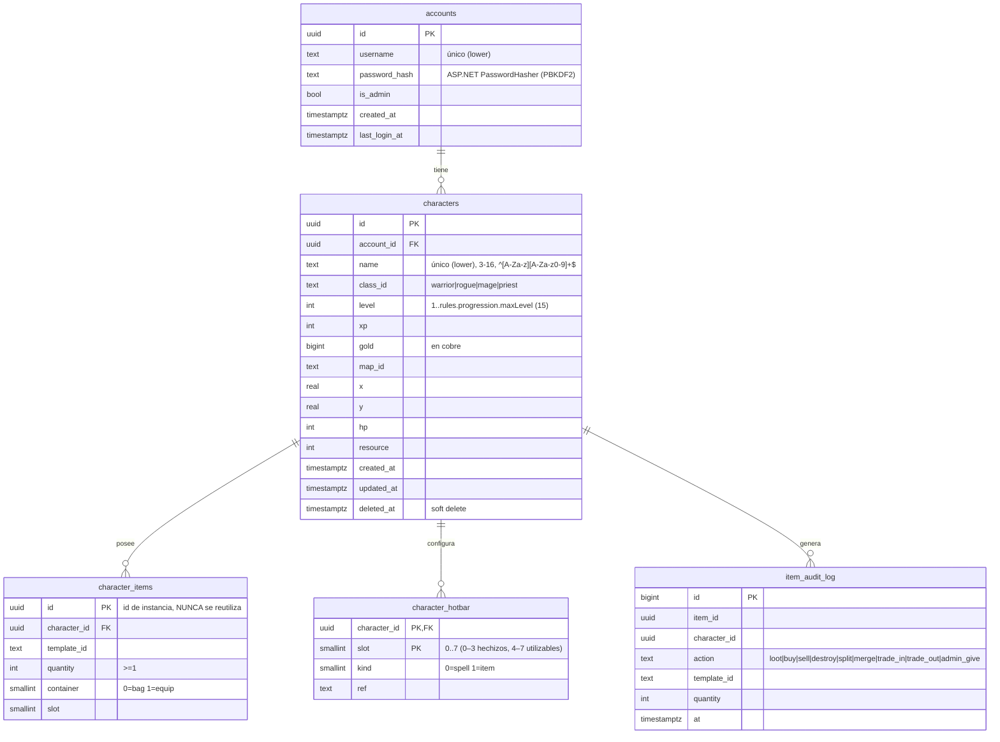

# Modelo de datos (PostgreSQL 17 + EF Core 10)

Convenciones: tablas y columnas en `snake_case` (`EFCore.NamingConventions` → `UseSnakeCaseNamingConvention()`),
PK `uuid` (UUID v7 generado en .NET: `Guid.CreateVersion7()`), timestamps `timestamptz` en UTC,
nombres únicos case-insensitive con índice sobre `lower(name)`.

Restricciones:
- `UNIQUE (character_id, container, slot)` en `character_items` (evita dos items en el mismo slot).
- `CHECK (quantity >= 1)`, `CHECK (level BETWEEN 1 AND 15)` (si `maxLevel` sube, migración).
- Máx 4 personajes por cuenta (validado en servicio).
- `item_audit_log.counterparty_character_id uuid NULL` para `trade_in`/`trade_out`.
- `characters.gold` en **cobre** (`1 oro = 100 plata = 10 000 cobre`); en UI se formatea.

Migraciones: una por HU que cambie el modelo, nombre `YYYYMMDD_Descripcion`. Nunca editar una migración ya aplicada
en el VPS; crear otra.
