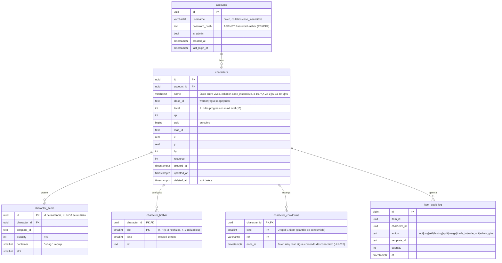

# Modelo de datos (PostgreSQL 17 + EF Core 10)

Convenciones: tablas y columnas en `snake_case` (`EFCore.NamingConventions` → `UseSnakeCaseNamingConvention()`),
PK `uuid` (UUID v7 generado en .NET: `Guid.CreateVersion7()`), timestamps `timestamptz` en UTC,
nombres únicos case-insensitive mediante la collation ICU no determinista `case_insensitive` (ver *Nombres únicos* abajo).

Restricciones:
- `UNIQUE (character_id, container, slot)` en `character_items` (evita dos items en el mismo slot).
- `CHECK (quantity >= 1)`, `CHECK (level BETWEEN 1 AND 15)` (si `maxLevel` sube, migración).
- Máx 4 personajes por cuenta: `ICharacterRepository.CreateAsync` cuenta e inserta en una transacción que bloquea la fila
  de la cuenta (`SELECT … FROM accounts WHERE id = … FOR UPDATE`), así que peticiones concurrentes no lo superan.
- `item_audit_log.counterparty_character_id uuid NULL` para `trade_in`/`trade_out`.
- `characters.gold` en **cobre** (`1 oro = 100 plata = 10 000 cobre`); en UI se formatea.

### Nombres únicos (sin distinguir mayúsculas)
- `accounts.username` y `characters.name` usan la collation **`case_insensitive`**: ICU, locale `und-u-ks-level2`,
  `deterministic = false`. Nivel 2 = ignora mayúsculas pero no acentos, así que `'Bob' = 'bob'` es verdadero.
- Los índices únicos `ix_accounts_username_ci` y `ix_characters_name_ci` (constantes en `GameDbContext`) van sobre la
  columna tal cual: al heredar la collation, son ellos los que rechazan `Bob`/`bob`, también en inserciones concurrentes.
  No hay índice sobre `lower(...)` ni hace falta `ToLower()` en las consultas: un `==` de EF ya compara sin mayúsculas y usa
  el índice.
- Los repositorios solo traducen a `username_taken` / `name_taken` una violación `23505` de **ese** índice; cualquier otro
  fallo de base de datos se propaga.
- Al borrar un personaje (soft delete) su nombre pasa a `Nombre#deleted-<id>` y queda libre (HU-013 CA4).
- Limitaciones de las collations no deterministas en PG 17: no admiten `LIKE`/`ILIKE` sobre esas columnas.
- La validación (`\A…\z`, solo ASCII) impide guardar nombres que ICU y `OrdinalIgnoreCase` (repositorio InMemory)
  compararían distinto; el login aplica la misma validación antes de consultar.

Migraciones: una por HU que cambie el modelo, nombre `YYYYMMDD_Descripcion`. Nunca editar una migración ya aplicada
en el VPS; crear otra.
